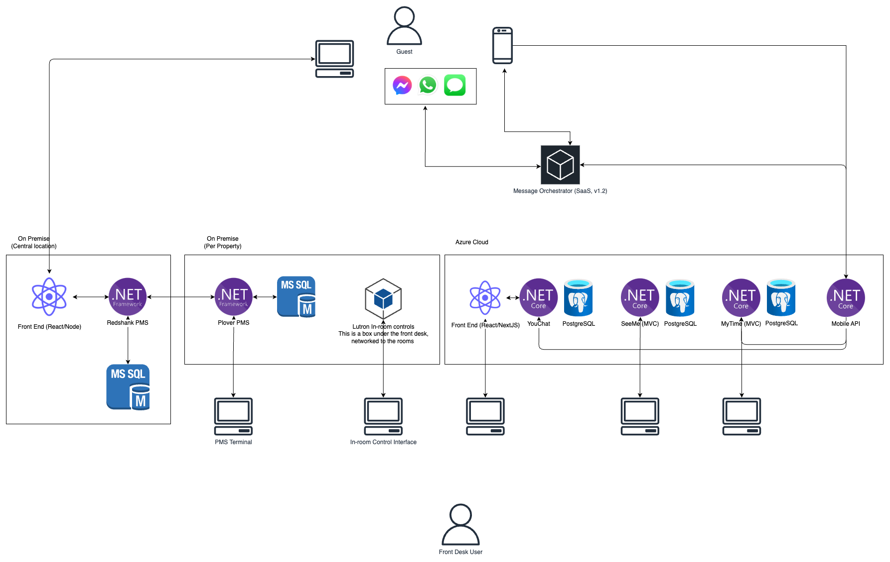
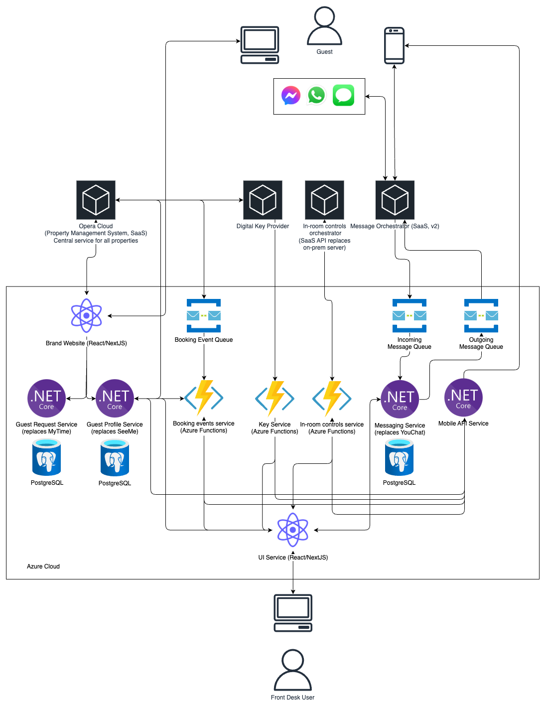

Rosefield is an award-winning, highly regarded luxury hotel chain with 22 properties in the UK and North America. Over the last 20 years the brand has increasingly used new technology to manage their properties and serve their guests, who expect the very highest level of service.

Over that time the Rosefield ecosystem has grown to include the following:

**Redshank: Brand-level Property Management System (PMS)**

Redshank PMS is an on-premise software solution widely used in the hospitality industry to manage hotel operations. Redshank PMS manages reservations, check-ins, room assignments, billing, reporting, and guest profile management. The brand-level instance of Redshank deployed on servers in their own data centre in North America where guest data from all properties is stored.

**Plover: Per-Property PMS**

Each property also has its own instance of a PMS hosted on premise in the hotel. This is commonly what the front-desk staff use day-to-day to check guests in and out and manage their data. Data is then synced nightly via a service layer to the central Redshank instance.

**A website**

Hosted on-premise in their data centre. The website includes the booking flow through which guests book stays in different properties. Bookings are made into the shared instance of Redshank and then synced to the property-level PMS.

**In-room Controls**

Each property has a server on-premise that provides in-room controls for guests to control things like lights, blinds and air conditioning. This system currently uses Telnet. Front-desk staff are able to control this via an interface so that rooms are set up appropriately for each guest when they check in.

Rosefield also have a set of newer applications hosted in Azure:

**YouChat**

YouChat is a messaging service that allows guests at any stage of their experience with Rosefield — pre-stay, in-stay and post-stay — to start a conversation with concierge staff at a specific property or a central office. Guests can use their messaging channel of choice — including WhatsApp, SMS, and Facebook Messenger — and staff can reply and manage conversations in a single unified web view.

**SeeMe**

SeeMe is a simple guest recognition and preferences tool which provides hotel staff with names, photos and useful details about VIP guests allowing them to provide highly personalised service. An example: Simon likes a vodka martini to be ready at the bar half an hour after he’s checked in to any property.

**MyTime**

MyTime is a request management tool through which staff can manage requests made by guests via the mobile app. Requests include things like room service, housekeeping and spa treatments. Requests in MyTime are synced to YouChat so that they appear in people’s conversations.

**A Mobile App (iOS and Android)**

The mobile app allows guests to access information, send messages and make requests. The mobile app is backed by its own API.

You can view an architecture diagram of the current state below:

You can also access [an XML version](assets/Rosefield.drawio.xml).

The current ecosystem has grown organically over time, and poses some big challenges in its current state:

- The Redshank PMS is what you might call a Big Ball of Mud. Over time it has become sprawling and difficult to maintain.
- There is data duplicated and disjointed in many places — guest data is distributed between two versions of Redshank as well as a number of PostgreSQL databases behind the bespoke apps in Azure.
- In-property PMS platforms are becoming expensive to maintain.
- The website and PMS instances are extremely cumbersome to deploy, and are currently released on a monthly schedule, delaying critical fixes and introducing new features.
- The API for YouChat was originally built as a PoC and it’s beginning to show signs of strain under the weight of hundreds of thousands of guest messages.
- There is a strong push in the business to move everything to the cloud to save costs, normalise ways of working and remain open to future features like digital room keys.

### The Future

Rosefield’s principal architect Geoff has designed a desired future state for the platform that aims to solve these issues and open the door to more integrations and a unified view of the guest. It includes the following:

**Migrating to Opera Cloud**

Opera Cloud is an industry-standard PMS offered as a multi-tenanted SaaS platform. Opera Cloud has a well-documented restful API which allows customers to programmatically migrate data into the system.

**Consolidating and stabilising applications in Azure**

Nic Evans, Rosefield’s Chief Product Officer, collaborated with Geoff on a design that involves consolidating the Guest Experience applications into a service-oriented architecture with a single interface through which staff can manage bookings, guest conversations, requests and guest recognition.

This will involve:

- Refactoring and improving the existing React front end to consume a series of APIs for each service.
- Refactoring the existing applications into discrete APIs.
- Implementing a set of queues for messages and requests, improving both performance and redundancy.

The main benefit of this from a hotel staff perspective is reducing the number of systems hotel staff interact with from four to one unified interface. This currently includes the property-level PMS as well as YouChat, SeeMe and MyTime. This causes a lot of headaches, and makes it challenging for staff to give guests a truly excellent service.

**Leveraging new technology**

There is an existing plan to retire the Telnet-based in-room controls in favour of a new version of the system that uses a modern RESTful JSON API. This will allow an integration with the mobile app and PMS, meaning guests can control their rooms from their own device and rooms can be automated based on check-in and check-out.

You can view an architecture diagram of the proposed future state below:

You can also access [an XML version](assets/Rosefield.drawio.xml).

The business is aiming to complete the migration to the cloud and retire the on-prem and on-property services in 10 months' time, when the current expensive contract with the external networking team expires. Rosefield has an established engineering function largely split into functional squads:

- The Guest Engineering Squad builds and maintains YouChat, SeeMe, MyTime and the mobile API.
- The Booking and Website Squad are responsible for the website and booking flow.
- The PMS Integration Squad builds and maintains Redshank and Plover.

Here’s a breakdown of the team:

| **Name** | **Role** | **Team** | **Type** |
| --- | --- | --- | --- |
| Sarah Thompson | Engineering Manager | Leadership | FTE |
| Geoff Sandpiper | Principal Architect | Leadership | FTE |
| James Carter | Product Manager | Guest Experience Squad | FTE |
| Priya Malhotra | Tech Lead | Guest Experience Squad | FTE |
| Emily Davis | Software Engineer | Guest Experience Squad | FTE |
| Liam Nguyen | Software Engineer | Guest Experience Squad | Contractor |
| Olivia Green | QA Engineer | Guest Experience Squad | FTE |
| Rachel Adams | Tech Lead | Booking & Website Squad | FTE |
| Lucas Martinez | Software Engineer | Booking & Website Squad | FTE |
| Ava Brown | QA Engineer | Booking & Website Squad | Contractor |
| Michael Scott | Product Manager | PMS Integration Squad | FTE |
| Zoe Walker | Tech Lead | PMS Integration Squad | FTE |
| Jacob White | Software Engineer | PMS Integration Squad | Contractor |
| Ethan Garcia | Software Engineer | PMS Integration Squad | FTE |
| Mia Rodriguez | QA Engineer | PMS Integration Squad | FTE |
| Laura Bell | UX/UI Designer | Shared Across Squads | FTE |
| Noah Bennett | UX/UI Designer | Shared Across Squads | Contractor |
| Alexander Moore | Delivery Manager | Shared Across Squads | FTE |
| Sophia Harris | Delivery Manager | Shared Across Squads | Contractor |
| Benjamin Taylor | Cloud Engineer | Platform and Operations | FTE |
| Victoria King | Cloud Engineer | Platform and Operations | Contractor |
| Grace Wilson | Data Engineer | Platform and Operations | Contractor |
| Daniel Lee | iOS Developer | Guest Experience Squad | Contractor |
| Maria Lopez | Android Developer | Guest Experience Squad | Contractor |

### Your Assignment

Your team has been tasked with the next stage of planning to support the transformation of the Rosefield ecosystem towards Geoff’s plan, and ensuring the migration is a success. In particular you need to produce:

**A Migration Plan**

This should include:

- a plan for migrating the data from the various PMS platforms into Opera Cloud with zero data loss.
- a plan to migrate the public-facing website and booking flow into the cloud with zero downtime for guest-facing applications.
- a plan to refactor the existing Guest Experience applications.
- a very high-level plan for how the teams might work.
- a high-level plan to up-skill or re-skill the team.
- any feedback or push-back on the proposed architecture.

**A Risk Register**

The migration will involve some high-risk steps to ensure data integrity is maintained and high-value guests don’t experience a degradation in service. Produce a high-level risk register outlining where the key risks are together with any mitigations.

You can use whatever tools you like to create your plans. You might consider
using [draw.io](https://www.draw.io), [Excalidraw](https://www.excalidraw.com/),
[Miro](https://www.miro.com), [Archi](https://www.archimatetool.com), or
something else.

### Your Stakeholders

**Geoff Sandpiper: Principal Architect**

Geoff will want to see that you’ve thought carefully about the future plan and will be focussed particularly on data integrity in the migration. He will be open to feedback on his plan if there are elements that you disagree with.

**Nic Evans: Rosefield Chief Product Officer**

Nic will want to understand the impact of the migration on the product from a staff perspective. He’ll be delighted if the migration involves minimal impact on hotel staff’s ability to deliver their famous high-touch service.

**Caroline Bryant: Rosefield Director of Guest Experience**

Caroline will be focussed on any guest impact. From her perspective this must stay at zero. She’ll be particularly focussed on any loss of data or service that negatively impacts a guest’s stay.

**Teams and Roles**

Teams will be announced on the day. [You can read more about your role here.](/games-and-roles)